# Facts From the Past
- developed by Arthur Ambalov

[Link to live webpage](https://github.com/artambdev/facts-from-the-past/)

## Table of Contents

1. [Overview](#overview)
2. [User Stories](#user-stories)
3. [Design](#design)
    1. [Colour](#colour)
    2. [Font](#font)
4. [Features](#features)
    1. [Pages](#pages)
5. [Validation](#validation)
    1. [HTML](#html)
    2. [CSS](#css)
    3. [Javascript](#javascript)
    4. [Accessibility](#accessibility)
    5. [Performance](#performance)
    6. [Browser Compatibility](#browser-compatibility)
    7. [Device Compatibility](#device-compatibility)
    8. [Testing User Stories](#testing-user-stories)
6. [Bugs](#bugs)
7. [Deployment](#deployment)
8. [Credits](#credits)

## Overview

Facts From the Past is an interactive website that aims to teach fun facts about history in an appealing way. Visitors are given a ten-question quiz on a variety of topics with a choice of four answers to pick from. Correct or incorrect, they are also offered tidbits of explanation behind the event or fact in question. Encouraging messages accompany their progress. The quiz can be replayed, with questions and answers shuffled into a new order to keep the player on their toes.

## Design
A few wireframes were made in advance of starting development to plan out the most important features and the structure of code that would be required to accompany them.

The wireframes are presented below:

### Colour
- A pleasant pattern of light lilac with pink highlights is meant to evoke a kind feeling to the quiz rather than a stressful one, a fun game rather than a test. Answer buttons are given different colours to distinguish them, with popups using gold colouration to indicate forwards progress.

### Font
- Headings use the Noto Sans font while other text uses the Lato font. Both are popular sans-serif fonts that are easy to read and suitable for viewing on screens. In case of a failure to load, they both default to the browser's default sans-serif font.

## Features
The website has 3 pages and (TODO: put a number here) features across them.

### Pages
The three pages are:
- A homepage that users to the site are automatically brought to, explaining the website's purpose and the quiz ahead with a button to begin
- A quiz page that contains the interactive quiz itself
- A custom 404 page that users are brought to when sent to an invalid page on the website, which offers a button to return to the homepage

## Validation

### HTML
All pages on the site are validated with the W3C's Markup Validation Service and show no errors or warnings. See each page below:

Homepage

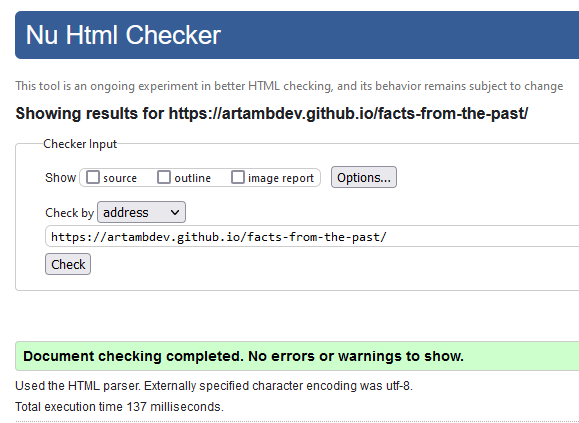

Quiz

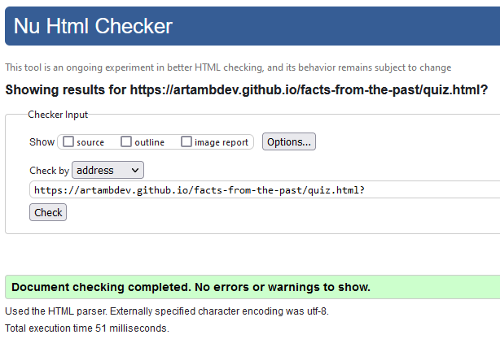

404 Page

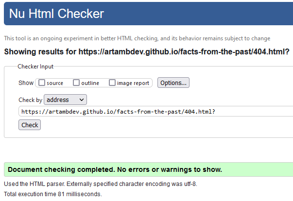

### CSS
The CSS style used by the site was validated with the W3C's CSS Validation Service, and showed no errors. There is one warning for the external stylesheet of Google Fonts which cannot be checked. See below:

No errors

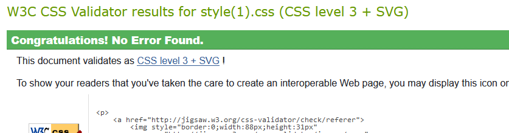

Warning

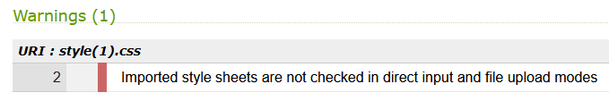

### JavaScript
The JavaScript code used by the quiz was validated with the JSHint Code Quality Tool, showing no errors or warnings.

Image

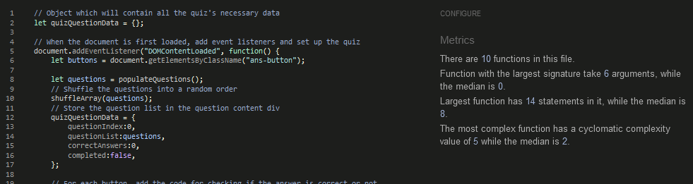

### Accessibility
All pages on the site are checked with the WAVE Website Accessibility Evaluation Tool, and none show any errors. See each page below:

Homepage

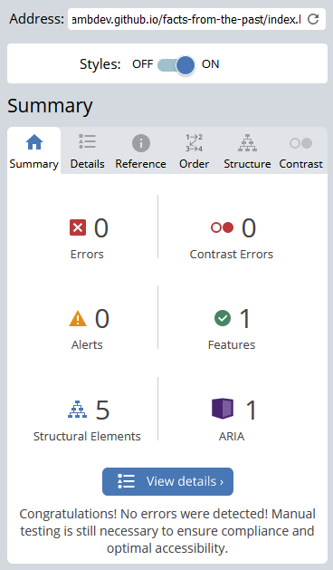

Quiz

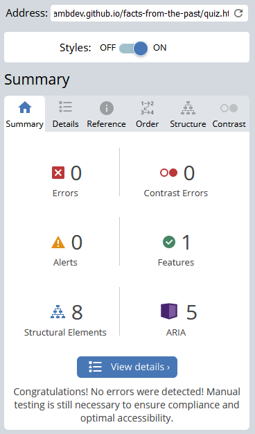

404 Page

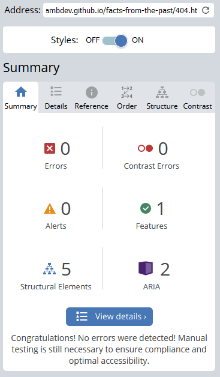

### Performance
Google Chrome's Lighthouse feature was used to check every page for performance issues, and each returned a high score in all categories. See each page's result below:

Homepage

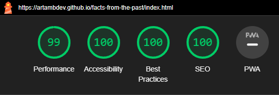

Quiz

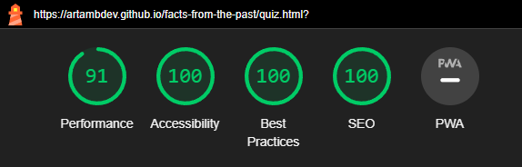

404 Page

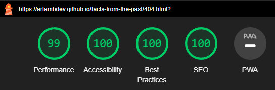

## Bugs
Notable bugs found during development:

- Once new questions were added with different correct answers, the quiz would reject any answer given and suggest an answer from another question entirely (for example, possibly suggesting that the first dog in orbit's name was the Aztec Empire). It was discovered that this is because the question list's index has already moved onto the next question once it has finished setting up the page. Checking the "previous" question solved this issue.
- After adding a white highlight when hovering buttons, the highlight function was broken only on the button on the quiz-completion popup to return to the homepage. It turns out this was because that button is the only one whose background and text color are determined by a CSS styling using an ID selector, which has a higher specificity than the CSS style used to style all hovered buttons. This was solved by using the "!important" affix on the hovered-button style's properties to give it a higher specificity that beats that of an ID selector.
- Scaling the questions' images with the screen size often cause the images to cause there to be a highly inconsistent amount of space on larger screens for the question's text, sometimes hiding it entirely behind the answer buttons. This was solved by giving the images a fixed size targeted for the smaller of the larger screens (i.e tablets).

## Deployment
The website was deployed with GitHub's deployment platform, GitHub Pages. The following steps were followed:
- Click on the "Settings" tab of the project's repository
- On the left, under the "Code and automation" section of the settings, navigate to "Pages"
- Under the "branch" option, select "main" and save
- After automatically refreshing, the page will show a small banner with a link to the live site

### Forking
On this project's repository, at the upper-right-hand side, there is a "fork" button to create a fork of it.

### Cloning
On this project's repository, at the upper-right-hand side, there is a "Code" button. To clone the project, click the button and:
- Choose between HTTPS, SSH or GitHub CLI as preferred and click the "Copy url to clipboard" button
- Open Git Bash
- Set the working directory to where the cloned project should be
- Type "git clone " followed by the copied URL
- Hit enter to create the cloned project

## Credits
Public domain or free-with-attribution images used:
- Presidential photos question: <a href="https://en.wikipedia.org/wiki/Mount_Rushmore#/media/File:Mountrushmore.jpg">unknown US National Parks Service employee</a>
- Empires question: <a href="https://pixabay.com/photos/rome-pantheon-italy-church-dome-7245470/">Leonard Niederwimmer</a>
- China textile questions: <a href="https://commons.wikimedia.org/wiki/File:Flores_y_colores_hechos_a_mano.jpg">Lily Sanchez</a>
- Elizabeth 2 coronation question: <a href="https://www.rct.uk/collection/2153177/queen-elizabeth-ii-b-1926nbspon-her-coronation-day">Cecil Beaton</a>
- Alexander the Great question: <a href="https://en.wikipedia.org/wiki/Alexander_the_Great#/media/File:Charles_Le_Brun_-_Entry_of_Alexander_into_Babylon.JPG">Charles Le Brun</a>
- Soviet Space Dog question: <a href="https://upload.wikimedia.org/wikipedia/en/7/71/Laika_%28Soviet_dog%29.jpg">Soviet Space Program</a>
- Normandy Landings question: <a href="https://upload.wikimedia.org/wikipedia/commons/a/a5/Into_the_Jaws_of_Death_23-0455M_edit.jpg">Robert F. Sargent</a>
- Castles question: <a href="https://en.wikipedia.org/wiki/Castle#/media/File:Panor%C3%A1mica_Oto%C3%B1o_Alc%C3%A1zar_de_Segovia.jpg">Ángel Sanz de Andrés</a>
- Parthenon question: <a href="https://en.wikipedia.org/wiki/Greek_mythology#/media/File:Achilles_Penthesileia_BM_B209.jpg">Great British Museum</a>
- George Washington question: <a href="https://commons.wikimedia.org/wiki/File:Residence_of_the_Washington_Family_on_the_Rappahannock.jpg">Washington Irving</a>
- Icons: <a href="https://fontawesome.com/icons">FontAwesome</a>

Technology used:
- Languages: HTML 5, CSS, JavaScript
- IDE: GitPod
- Version control: GitHub
- Deployment: GitHub's Pages feature
- Wireframing: Balsamiq
- Validation: W3C HTML Validator, W3C CSS Validator, WAVE Website Accessibility Evaluation Tool, Google Chrome
- Art program: paint.net
- Color palette design: <a href="https://mycolor.space">ColorSpace</a>

Code:
- Code for 404 page functionality was taken from <a href="https://docs.github.com/en/pages/getting-started-with-github-pages/creating-a-custom-404-page-for-your-github-pages-site">GitHub's documentation for GitHub Pages</a>
- Fisher-Yates shuffle algorithm was learned from <a href="https://www.freecodecamp.org/news/how-to-shuffle-an-array-of-items-using-javascript-or-typescript/">Free Code Camp</a>

Other:
- Mo Shami for mentoring, guidance and feedback throughout the project.